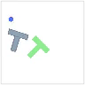
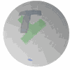

# Fast Flow-based Robot Motion Policy

This repository contains the source code of my master thesis 'Fast Flow-based Robot Motion Policy'.

## Abstract
Diffusion policies (DPs) excel at Behavior Cloning and capturing multi-modal action distributions but suffer from lengthy inference time due to high computational costs. While techniques like Consistency Policy aim to address this, it introduces complexities in training. This paper introduces Riemannian Flow Matching Policy (RFMP) as a more efficient alternative. Leveraging the faster generation and training capabilities of flow matching (FM), RFMP reduces the required number of function evaluations (NFE) compared to DPs. To enhance stability, we propose Stable RFMP (SRFMP) for generating reliable results on Riemannian manifolds. Through rigorous evaluation on eight simulated and real-world tasks, we demonstrate RFMP's superior robustness to NFE, achieving real-time control (30Hz) on a real-world robot with reduced training epochs.

## Examples
'examples': train & test code for different policies (DP, RFMP, SRFMP) on 8 tasks.  
6 tasks in simulator: Euclidean & Sphere Push-T, Robomimic Lift, Can, Square, Tool Hang with both state & vision based observation  
2 tasks on real robot: Pick & Place, Rotate Mug  
## Simulator: Euclidean & Sphere Push-T
   
## Simulator: Robomimic tasks Lift, Can, Square, Tool Hang with state or vision observation
 
 
## Real Robot: Pick & Place, Rotate Mug
   
